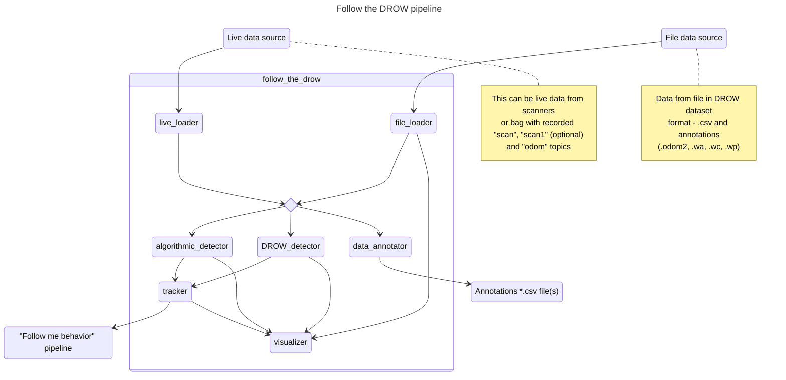

# Follow the DROW

This project studies DROW person detector and algorithmic detector performance.

It also contains a pipeline for using different data sources and detectors as ROS nodes.

Finally, it suggests another neural network architectures that might perform better than DROW detector neural network.

## Contents of the repository

This repository consists of several parts:

1. Library - a library of detectors, datasets and other utilities, written in python and c++ with interoperability means.
2. ROS system - a system for running data source, detectors and visualization pipeline in ROS nodes inside of a Docker container (using library).
3. Research part - Jupyter notebooks for visualization and testing library detectors properties and performance.

## Library

Library is located inside of the `library` directory.

### C++ library

C++ library is located inside of the `library/cpp_core` directory.

It is a C++ static library, it can be compiled and installed with special `make` command:

```bash
make build-lib
```

> NB! The command will install the library only if it was run by a superuser.

All the library classes and functions belong to `follow_the_drow` namespace.

The library includes:

1. `AlgorithmicDetector` class.
   This class implements an algorithmic person detector.
   Detector arguments are provided to it as constructor arguments.
   The detectrion can be done by using `forward` method with different arguments number.
   This method accepts detections as `Point`s and returns vector of `Point`s.
2. `Cluster` class.
   This class represents a cluster of points, situated next to each other.
   Its' constructor accepts first and last point **indexes** and the whole detected points vector.
   It has several useful methods for calculating different cluster properties:
   - `size`: distance from start to end points.
   - `start`: start point index.
   - `middle`: middle point index.
   - `end`: end point index.
   - `startPoint`: start point.
   - `middlePoint`: middle point.
   - `betweenPoint`: the point between cluster start and end.
   - `endPoint`: end point.
   - `distanceTo`: distance to other class.
   - `middleBetween`: the point between between points of this cluster and other cluster.
   > NB! If a cluster consists of 3 points: (0, 1), (0, 0) and (1, 0) - the middle point will be (0, 0) and the between point will be (0.5, 0.5).
3. `Point` class.
   This class represents a geometrical 2D point.
   It has several useful methods for working with points:
   - `polarToCartesian`: converts polar data (distance and angle) to point.
   - `distanceTo`: distance between two points.
   - `middleBetween`: point between two points.
   - ...also operators for points addition and substraction are defined.
4. `Tracked` class.
   This class represents a tracked point: point, including frequency and uncertainty.
5. `utils` file contains utility functions.
6. `binding` file includes classes and functions for Python interoperability.
   `PythonDetectorFactory` provides a pythonic interface for using `AlgorithmicDetector` class.
   > NB! This file won't be included into standalone library distribution!

### Python library

Python library is located inside of the `library/follow_the_drow` directory.

This library can be installed (for example) with this command:

```bash
pip3 install ./library
```

> NB! During installation, the DROW dataset (measures, annotations and model weights) will be downloaded and included into the library distribution.

**Important note**: the detectors in this library do not perform detection for single scans.
They use sets of scans (they were called "temporal cutouts" in the paper), consisting of 5 scans and one annotation.
There are several reasons for that.
First of all, by combining data from 5 consecutive scans authors of the DROW paper intended to reflect temporal dependencies.
Secondly, the authors didn't annotate every scan by hand, they annotated every fifth scan instead.

The library includes:

1. `DROW_Dataset` class.
   This class represents DROW dataset data source.
   It loads DROW dataset from file in its constructor.
   Its `get_scan` method extracts temporal cutout from dataset.
   `TIME_FRAME` constant stores the measures to annotations rate (5 for DROW dataset).
2. `LiveDataset` class.
   This class represents a live data source with kind of similar interface.
   Unlike DROW dataset, live data source uses two lidar scans.
   It uses queues to store last several scans (5 in this case in order to match DROW dataset time frame).
   It has `get_bottom_scan` and `get_top_scan` methods for retrieving last temporal cutout from bottom and top laser respectively.
   It also has `push_measure` method for pushing new scans to queues.
3. `Detector` class.
   This is a base class for detectors.
   Its `init` method is the preferred constructor for child classes.
   Method `forward_one` can be used for performing detection of one temporal cutout.
   Method `forward_all` can be used for performing detection of all temporal cutouts from dataset.
4. `AlgorithmicDetector` class.
   This class is a wrapper for C++ library class `PythonDetectorFactory`.
   It creates algorithmic detector, acts as a proxy for `forward_one` method and provides TQDM loops for implementation of `forward_all` method.
5. `DrowDetector` class.
   This class contains neural network of architecture provided by the DROW paper.
   It doesn't use GPU (unless static variable `GPU` is set).
   It loads model weights from file published together with DROW paper during initialization.
6. `drow_utils` file contains utility methods used by the DROW paper authors.
7. `file_utils` file contains paths to downloaded and stored DROW dataset and weights, it also contains function for caching slow function results.
8. `generic_utils` file contains generic base classes and functions.
9. `plot_utils` file contains plotting utility functions (for matplotlib library).
10. `torch_utils` file contains neural network utility functions (for pytorch library).

## ROS ecosystem

The system is designed to be used for Docker.
All detectors and loaders are implemented as nodes.
There are also special `visualizer` and `tracker` nodes for convenient user experience and integration.

The Docker-related configurations are stored in `deploy/docker` directory.

> NB! Special attention should be paid to Docker network and environment settings. They are vital for connection to RobAIR and ROS GUI apps.

Dockerfile contains two targets: `basic` and `ftd`.
Basic target is described in `ROS_IMAGE.md` file and can be used for integration of any ROS apps with Docker.
FTB target includes `follow_the_drow` libraries and is specialized for this specific app.

> NB! All user configuration should be done via `deploy/conf.env` file. It contains general system configurations and parameters and special parameters for every node. All these will be described below.

System configurations are stored in `deploy/config` directory.
This directory is copied into `follow_the_drow` package root (but can be also copied to every other package root).
It contains configurations for RVIZ (two versions), RobAIR physical transformations and launch file.

Find diagram of ROS nodes pipeline below:



These are general system configurations and parameters:

- `RVIZ_RVIZ` (boolean) enables RVIZ visualization window (default: true).
- `ROSBAG_PLAY` (boolean) enables playing bag data (default: false) from `RECORD_LOCATION` (string) file (default: "latest.bag").
- `FOLLOW_ME_BEHAVIOR` (boolean) enables "follow me behavior" pipeline connection (default: false).
- Each node has boolean variable for enabling and disabling it (default: all nodes are enabled except for `live_loader` and `data_annotator`).
- `HEARTBEAT_RATE` (number) system frequency rate (default: 10Hz).
- `RAW_DATA_TOPIC` (string) "raw data" topic name, data from `live_loader` and `file_loader` nodes is published there and picked up by `tracker` and `visualizer` nodes (default: "raw_data").
- `ANNOTATED_DATA_TOPIC` (string) "annotated data" topic name, annotated data from `file_loader` is published there and picked up by `visualizer` node (default: "annotated_data").
- `ALGORITHMIC_DETECTOR_TOPIC` (string) detection results from algorithmic detector is published there from `algorithmic_detector` and picked up by `visualizer` and `tracker` (default: "algorithmic_detector").
- `DROW_DETECTOR_TOPIC` (string) detection results from DROW detector is published there from `DROW_detector` and picked up by `visualizer` and `tracker` (default: "drow_detector").
- `FOLLOW_ME_BEHAVIOR_TOPIC` (string) tracked person position is published to this topic by `tracker` and picked up by `visualizer` node and "follow me behavior" pipeline.
- `DATA_ANNOTATION_RATE` (integer) scans to annotations rate (5 for DROW dataset, see "temporal cutouts").

## ROS package

This project can be run not only locally, but also on RobAIR.
However, a few things have to be doublechecked for that:

1. Connection (host IP and RobAIR IP): see `Makefile`.
2. **Input** topics and frames names: see `robair_ufr.launch` in `robairmain` package on RobAIR and `deploy/conf.env`.
3. Follow me behavior nodes names and packages: see `~/catkin_ws/src` on RobAIR and `deploy/conf.env`.

> NB! Make sure ROS is **not** running on RobAIR - that would lead to node name collisions!

Run it with this command:

```bash
make launch-docker-robot
```

### ... nodes

???

### Debug

> NB! Nodes are _by default_ built with debug info **and** GDB is included into Docker image.

In order to run any of the nodes with GDB, add `launch-prefix="gdb -batch -ex run -ex bt --args"` to node arguments (it is added by default).

In file `deploy/follow_the_drow/CMakeLists.txt` in line #5 `RelWithDebInfo` can be changed to `Release` for release artifact producing or to `Debug` for debug artifact producing.

## Notebooks

???

## Other

???

## Notes

### DROW dataset

Contains many sequences, each sequence has:

1. `.bag.csv` file - 1st column contains unique index, 2nd column contains timestamp, other columns contains scans data.
2. `.bag.odom2` file - 1st column contains unique index, 2nd column contains timestamp, three last columns contain odometry data (X-axis, Y-axis and angle).
3. `.bag.wa` file - 1st column contains unique index, second - array of **walker** detections.
4. `.bag.wc` file - 1st column contains unique index, second - array of **wheelchair** detections.
5. `.bag.wp` file - 1st column contains unique index, second - array of **person** detections.

### RobAIR FoV

RobAIR lidar has 726 rays, it covers ??? degrees.
RobAIR camera has more narrow field of view: it starts on ray **315** and ends on ray **430**.

### DROW detector frequency

In the DROW paper system frequency was 12.5Hz.
Here, it was decided to lower this number to 10Hz for compatibility reasons.

> NB! Neither the laptop the system was launched, nor RobAIR have GPU, so neural network based DROW detector operates _really_ slowly (at approximately 1 Hz).

## TODOs

1. In the DROW paper translation odometry data was not used while calculating "cutouts" - using it might improve performance.
2. Add possibility for recording bag files (add configurations to launch file and `conf.env`, store bag files in `out` directory).
3. The DROW dataset is very poorly annotated - it can be re-annotated (by and or algoritmically) in order to improve real world performance.
4. The DROW detector neural network uses complicated "cutouts" system in order to receive temporal data - it can be simplified (and probably improved) by using recurrent neural network.
5. The DROW detector neural network uses complicated "votes" system in order to calculate human positions - this can be simplified (and probably improved) by using a different neural network architecture:

Let `n` be the ray count.
Then neural network input shape will be `n` floats - `n` distances for `n` laser measures (or `2n` for 2 lidars).
The output shape will be `n` floats - each of them will be a **probability of the laser measurement to hit a person**.
Then the output data will be converted to coordinates using laser data.

## Roadmap

1. Setup follow me behavior interop (topics, connections)
2. Tracking node: consistent output
3. Complete readme(s)
4. Write a report
5. Fill in README gaps (`???`)
